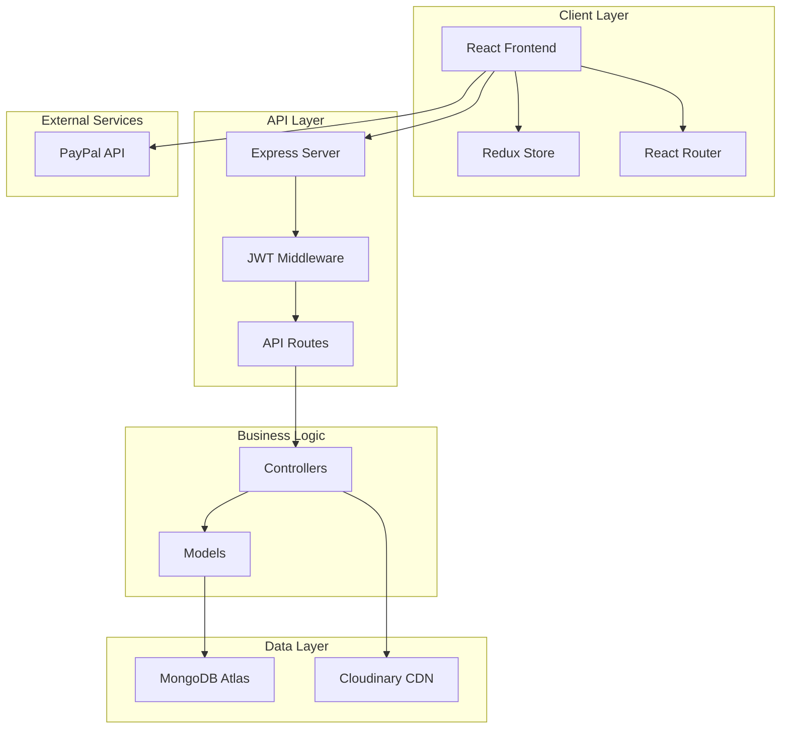

<div align="center">


# 🐰 Rabbit E-Commerce Platform

**A Modern, Full-Stack E-Commerce Solution Built with MERN Stack**

[](https://opensource.org/licenses/MIT)
[](https://nodejs.org/)
[](https://reactjs.org/)
[](https://www.mongodb.com/)

[Features](#-features) • [Tech Stack](#-tech-stack) • [Getting Started](#-getting-started) • [API Documentation](#-api-documentation) • [Contributing](#-contributing)

</div>

---

## 📋 Table of Contents

- [Overview](#-overview)
- [Features](#-features)
- [Tech Stack](#-tech-stack)
- [Architecture](#-architecture)
- [Getting Started](#-getting-started)
- [Project Structure](#-project-structure)
- [API Documentation](#-api-documentation)
- [Deployment](#-deployment)
- [Contributing](#-contributing)
- [License](#-license)

---

## 🎯 Overview

**Rabbit** is a modern, full-featured e-commerce platform designed to provide a seamless shopping experience. Built with the MERN stack (MongoDB, Express.js, React, Node.js), it offers a robust backend API, a responsive frontend interface, and comprehensive admin management tools.

### Why Rabbit?

- ⚡ **Fast & Responsive** - Built with Vite and optimized for performance
- 🔒 **Secure** - JWT authentication, bcrypt password hashing, and secure payment processing
- 🎨 **Modern UI** - Beautiful, responsive design with Tailwind CSS
- 📦 **Scalable** - Modular architecture ready for growth
- 💳 **Payment Ready** - Integrated PayPal payment gateway
- 🛡️ **Admin Panel** - Complete control over products, orders, and users

---

## ✨ Features

### 🛍️ Customer Features

- **User Authentication & Authorization**
  - Secure registration and login with JWT tokens
  - Password encryption with bcryptjs
  - Protected routes and user sessions

- **Product Browsing**
  - Browse products by categories (Men's, Women's collections)
  - Advanced product filtering and search
  - Product details with image galleries
  - Featured products showcase

- **Shopping Cart**
  - Add/remove items from cart
  - Update product quantities
  - Persistent cart storage
  - Real-time price calculations

- **Checkout & Payment**
  - Secure checkout process
  - PayPal payment integration
  - Order summary and confirmation
  - Multiple shipping addresses support

- **Order Management**
  - View order history
  - Track order status
  - Order details and receipts
  - Reorder functionality

- **User Profile**
  - Update personal information
  - Manage shipping addresses
  - View order history
  - Account settings

### 👨‍💼 Admin Features

- **Dashboard**
  - Sales analytics and statistics
  - Recent orders overview
  - User management metrics

- **Product Management**
  - Create, update, and delete products
  - Image upload with Cloudinary integration
  - Inventory management
  - Category management

- **Order Management**
  - View all orders
  - Update order status
  - Process refunds
  - Order fulfillment tracking

- **User Management**
  - View all registered users
  - User role management
  - Account activation/deactivation

### 📧 Additional Features

- **Newsletter Subscription**
  - Email collection for marketing
  - Subscriber management

- **Responsive Design**
  - Mobile-first approach
  - Optimized for all screen sizes
  - Touch-friendly interface

---

## 🛠️ Tech Stack

### Frontend

| Technology | Version | Purpose |
|------------|---------|---------|
| **React** | 19.1.1 | UI library for building user interfaces |
| **Redux Toolkit** | 2.11.0 | State management |
| **React Router DOM** | 7.9.4 | Client-side routing |
| **Tailwind CSS** | 4.1.15 | Utility-first CSS framework |
| **Vite** | 7.1.14 | Build tool and dev server |
| **Axios** | 1.13.2 | HTTP client for API requests |
| **PayPal React SDK** | 8.9.2 | Payment integration |
| **Sonner** | 2.0.7 | Toast notifications |

### Backend

| Technology | Version | Purpose |
|------------|---------|---------|
| **Node.js** | 16+ | JavaScript runtime |
| **Express.js** | 5.1.0 | Web application framework |
| **MongoDB** | - | NoSQL database |
| **Mongoose** | 8.19.3 | MongoDB object modeling |
| **JWT** | 9.0.2 | Authentication tokens |
| **bcryptjs** | 3.0.3 | Password hashing |
| **Cloudinary** | 2.8.0 | Image hosting and management |
| **Multer** | 2.0.2 | File upload handling |
| **CORS** | 2.8.5 | Cross-origin resource sharing |
| **dotenv** | 17.2.3 | Environment variable management |

### Development Tools

- **ESLint** - Code linting
- **Prettier** - Code formatting
- **Nodemon** - Auto-restart development server
- **Babel React Compiler** - React optimization

---

## 🏗️ Architecture



### Design Patterns

- **MVC Architecture** - Separation of concerns between models, views, and controllers
- **RESTful API** - Standard HTTP methods for CRUD operations
- **JWT Authentication** - Stateless authentication mechanism
- **Redux Pattern** - Centralized state management
- **Component-Based Architecture** - Reusable React components

---

## 🚀 Getting Started

### Prerequisites

Before you begin, ensure you have the following installed:

- **Node.js** (v16.0.0 or higher)
- **npm** or **yarn**
- **MongoDB Atlas account** (or local MongoDB installation)
- **Cloudinary account** (for image uploads)
- **PayPal Developer account** (for payment processing)

### Installation

1. **Clone the repository**

```bash
git clone https://github.com/yourusername/rabbit.git
cd rabbit
```

2. **Install root dependencies**

```bash
npm install
```

3. **Install backend dependencies**

```bash
cd backend
npm install
```

4. **Install frontend dependencies**

```bash
cd ../frontend
npm install
```

### Environment Variables

#### Backend Environment Variables

Create a `.env` file in the `backend` directory:

```env
# Server Configuration
PORT=9000

# Database
MONGO_URI=your_mongodb_connection_string

# JWT Secret
JWT_SECRET=your_super_secret_jwt_key

# Cloudinary Configuration
CLOUDINARY_CLOUD_NAME=your_cloudinary_cloud_name
CLOUDINARY_API_KEY=your_cloudinary_api_key
CLOUDINARY_API_SECRET=your_cloudinary_api_secret
```

#### Frontend Environment Variables

Create a `.env` file in the `frontend` directory:

```env
# API Base URL
VITE_API_URL=http://localhost:9000

# PayPal Client ID
VITE_PAYPAL_CLIENT_ID=your_paypal_client_id
```

### Running the Application

#### Development Mode

1. **Start the backend server**

```bash
cd backend
npm run dev
```

The backend will run on `http://localhost:9000`

2. **Start the frontend development server**

```bash
cd frontend
npm run dev
```

The frontend will run on `http://localhost:5173`

#### Production Mode

1. **Build the frontend**

```bash
cd frontend
npm run build
```

2. **Start the backend server**

```bash
cd backend
npm start
```

### Seeding the Database

To populate the database with sample data:

```bash
cd backend
npm run date
```

---

## 📁 Project Structure

```
rabbit/
├── backend/                    # Backend application
│   ├── config/                # Configuration files
│   │   └── db.js             # Database connection
│   ├── data/                  # Seed data
│   ├── middleware/            # Custom middleware
│   ├── models/                # Mongoose models
│   │   ├── User.js
│   │   ├── Product.js
│   │   ├── Cart.js
│   │   ├── Order.js
│   │   ├── Checkout.js
│   │   └── Subscriber.js
│   ├── routes/                # API routes
│   │   ├── userRoutes.js
│   │   ├── ProductRoutes.js
│   │   ├── CartRoutes.js
│   │   ├── checkoutRoutes.js
│   │   ├── orderRoutes.js
│   │   ├── uploadRoutes.js
│   │   ├── subscribeRoutes.js
│   │   ├── adminRoutes.js
│   │   ├── productAdminRoutes.js
│   │   └── adminOrderRoutes.js
│   ├── .env                   # Environment variables
│   ├── server.js              # Express server entry point
│   ├── seeder.js              # Database seeder
│   ├── package.json
│   └── README.md              # Backend documentation
│
├── frontend/                   # Frontend application
│   ├── public/                # Static files
│   ├── src/
│   │   ├── Components/        # React components
│   │   │   ├── Admin/        # Admin components
│   │   │   ├── Cart/         # Cart components
│   │   │   ├── Common/       # Shared components
│   │   │   ├── Layout/       # Layout components
│   │   │   └── Products/     # Product components
│   │   ├── pages/            # Page components
│   │   │   ├── Home.jsx
│   │   │   ├── Login.jsx
│   │   │   ├── Register.jsx
│   │   │   ├── Profile.jsx
│   │   │   ├── CollectionPage.jsx
│   │   │   ├── MyOrder.jsx
│   │   │   ├── OrderDetailsPage.jsx
│   │   │   ├── OrderConfirmationPage.jsx
│   │   │   └── AdminHomePage.jsx
│   │   ├── redux/            # Redux store and slices
│   │   ├── App.jsx           # Main App component
│   │   ├── main.jsx          # Entry point
│   │   └── index.css         # Global styles
│   ├── .env                   # Environment variables
│   ├── vite.config.js        # Vite configuration
│   ├── tailwind.config.js    # Tailwind configuration
│   └── package.json
│
├── assets/                     # Project assets
│   ├── rabbit-banner.png
│   ├── rabbit-hero.webp
│   ├── featured.webp
│   ├── mens-collection.webp
│   ├── womens-collection.webp
│   ├── login.webp
│   └── register.webp
│
├── .gitignore
├── CONTRIBUTING.md            # Contribution guidelines
├── LICENSE                    # MIT License
├── package.json               # Root package.json
└── README.md                  # This file
```

---

## 📚 API Documentation

For detailed API documentation, please refer to the [Backend README](./backend/README.md).

### Quick API Reference

**Base URL:** `http://localhost:9000/api`

#### Main Endpoints

| Endpoint | Method | Description | Auth |
|----------|--------|-------------|------|
| `/users/register` | POST | Register new user | No |
| `/users/login` | POST | User login | No |
| `/users/profile` | GET | Get user profile | Yes |
| `/products` | GET | Get all products | No |
| `/products/:id` | GET | Get product by ID | No |
| `/cart` | GET | Get user cart | Yes |
| `/cart/add` | POST | Add to cart | Yes |
| `/checkout/create-order` | POST | Create order | Yes |
| `/orders/myorders` | GET | Get user orders | Yes |
| `/admin/products` | POST | Create product | Admin |
| `/admin/orders` | GET | Get all orders | Admin |

For complete API documentation with request/response examples, see [Backend API Documentation](./backend/README.md).

---

## 🤝 Contributing

We welcome contributions to Rabbit! Please read our [Contributing Guidelines](./CONTRIBUTING.md) for details on:

- Code of Conduct
- How to report bugs
- How to suggest enhancements
- Pull request process
- Coding standards

### Quick Start for Contributors

1. Fork the repository
2. Create your feature branch (`git checkout -b feature/AmazingFeature`)
3. Commit your changes (`git commit -m 'Add some AmazingFeature'`)
4. Push to the branch (`git push origin feature/AmazingFeature`)
5. Open a Pull Request

---

## 📞 Contact

**Project Maintainer:** Mohamed Elsafyas

- GitHub: [@ELSEFI](https://github.com/ELSEFI)
- Email: mohamedelsefi11@gmail.com
- LinkedIn: [Your LinkedIn](https://eg.linkedin.com/in/mohamed-elsayed-496142385)

**Project Link:** [https://github.com/yourusername/rabbit](https://github.com/yourusername/rabbit)

---

## 🙏 Acknowledgments

- [React Documentation](https://react.dev/)
- [Express.js](https://expressjs.com/)
- [MongoDB](https://www.mongodb.com/)
- [Tailwind CSS](https://tailwindcss.com/)
- [PayPal Developer](https://developer.paypal.com/)
- [Cloudinary](https://cloudinary.com/)
- [Vite](https://vitejs.dev/)
- [Redux Toolkit](https://redux-toolkit.js.org/)

---

## 📊 Project Stats

- **Backend Routes:** 10 route files
- **Database Models:** 6 models
- **Frontend Components:** 25+ components
- **Pages:** 9 pages
- **Tech Stack:** MERN (MongoDB, Express, React, Node.js)

---

<div align="center">

**Made with ❤️ by Mohamed Elsefi**

⭐ Star this repo if you find it helpful!

[Report Bug](https://github.com/yourusername/rabbit/issues) • [Request Feature](https://github.com/yourusername/rabbit/issues)

</div>
